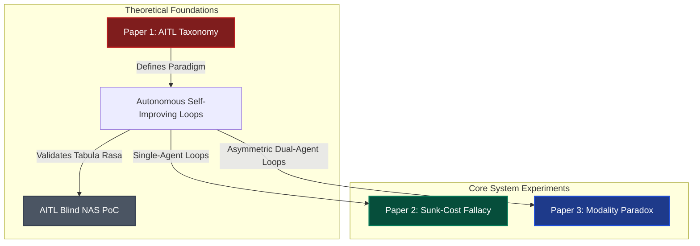
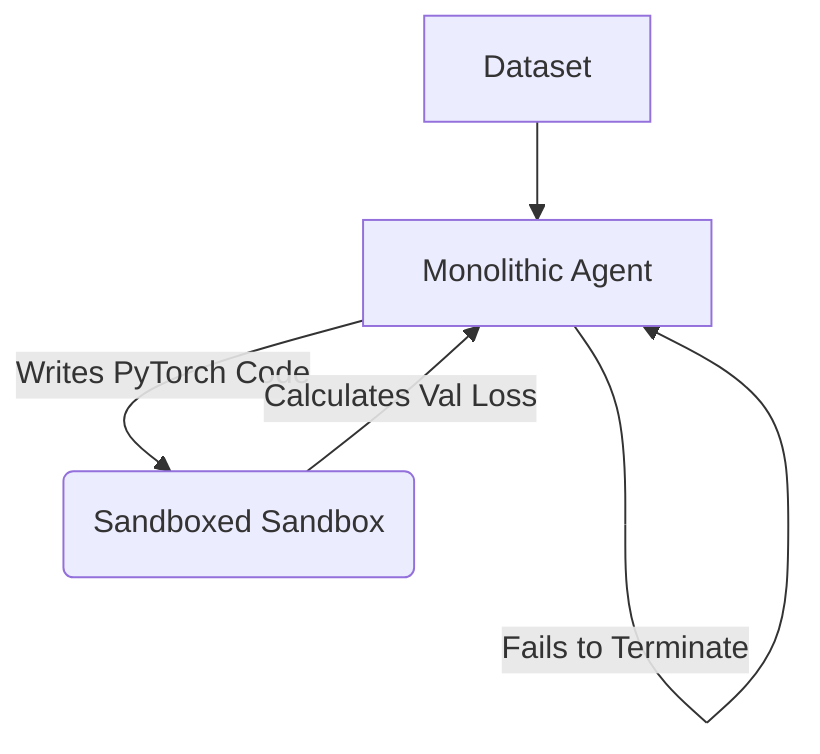
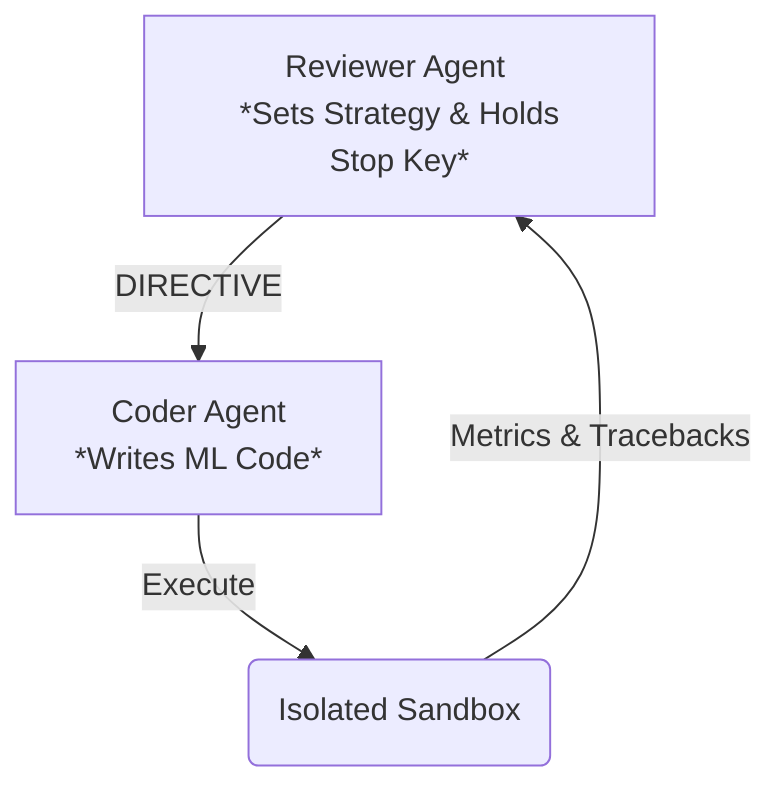

# AITL & AEOS Research Repository 

[](https://zenodo.org/records/19551173)
[](https://zenodo.org/records/19846960)
[](#paper-3-the-modality-paradox)
[](https://www.neuralchemy.in/)

Welcome to the consolidated research repository of **Neuralchemy Labs** for **AI In The Loop (AITL)** and **Autonomous Empirical Optimization System (AEOS)** research. 

This repository contains the complete experimental code, active search loops, configurations, data loaders, and paper manuscripts for **Paper 1 (Taxonomy & PoC)**, **Paper 2 (Sunk-Cost Fallacy)**, and **Paper 3 (Modality Paradox)**. 

---

## 🏛️ Repository File Structure

To make navigation simple and intuitive, the repository is organized into five main areas:

```text
AI-In-The-Loop/                     # Repository Root
├── archive/                        # Legacy and out-of-scope paper archives (ignored from GitHub)
│   ├── legacy_paper1/              # Paper 1 taxonomy manuscript drafts
│   ├── legacy_paper4/              # Paper 4 (Gatekeepers & MoE) archived sources
│   ├── legacy_paper5/              # Paper 5 (Lab Director & Closed-Loop) archives
│   ├── legacy_blind_nas/           # Legacy AITL Blind NAS PoC code
│   └── legacy_AITL_main/           # Archived raw files from the original AITL repo
├── docs/                           # Core research & architectural documentation
├── paper/                          # Scientific manuscript directories
│   ├── paper1_taxonomy/            # Paper 1: AITL Taxonomy manuscript, built PDF & figures
│   ├── paper2_sunk_cost/           # Paper 2: Sunk-Cost Fallacy manuscript & built PDF
│   └── paper3_modality_paradox/    # Paper 3: Modality Paradox LaTeX sources & PDF
├── aeos_sunk_cost/                 # ACTIVE CODE: Paper 2 (Sunk-Cost Fallacy)
│   ├── results/                    # Sunk-Cost single-agent run metrics
│   ├── agent.py                    # Monolithic autonomous agent
│   └── runner.py                   # Single-agent driver
└── experiments/                    # ACTIVE CODE: Active experimental sweeps
    ├── aitl_blind_nas/             # ACTIVE CODE: Paper 1 Proof-of-Concept (Blind NAS Tuner)
    │   ├── concept.md              # Blinding mechanism details
    │   ├── agent.py                # Architecture search agent
    │   ├── trainer.py              # PyTorch training sandbox
    │   └── runner.py               # Main tuner loop runner
    └── modality_paradox/           # ACTIVE CODE: Paper 3 (Modality Paradox)
        ├── results/                # Cross-modality JSON logs
        ├── runner_critic.py        # Asymmetric Coder-Reviewer loop
        ├── run_math_ablation.py    # Math prompt self-reflection sweep
        ├── aggregate_paper3.py     # Aggregator tool
        └── build_paper3_assets.py  # High-res chart generator
```

---

## 📖 The Research Trilogy



### 🔴 Paper 1: AITL Taxonomy & Foundations
* **Title**: *AI In The Loop (AITL): A Systems Taxonomy for Closed-Loop Autonomous Evaluation*
* **Manuscript Directory**: [`paper/paper1_taxonomy/`](file:///f:/AI-IN-THE-LOOP/aitl-paper/paper/paper1_taxonomy)
* **Active Codebase**: [`experiments/aitl_blind_nas/`](file:///f:/AI-IN-THE-LOOP/aitl-paper/experiments/aitl_blind_nas)
* **Paradigm**: Establishes the core systems taxonomy of AI In The Loop. Demonstrates how to prove empirical optimization self-improvement by "blinding" the search LLM to prevent zero-shot parametric memorization of standard datasets.

---

### 🟢 Paper 2: Sunk-Cost Fallacy (AEOS Core)
* **Title**: *The Autonomous Sunk-Cost Fallacy: Stopping Failures and Meta-Reasoning in LLMs Deployed within AEOS*
* **Manuscript Directory**: [`paper/paper2_sunk_cost/`](file:///f:/AI-IN-THE-LOOP/aitl-paper/paper/paper2_sunk_cost)
* **Active Codebase**: [`aeos_sunk_cost/`](file:///f:/AI-IN-THE-LOOP/aitl-paper/aeos_sunk_cost)
* **Paradigm**: Demonstrates how a monolithic, single-agent loop trapped in an open-ended code optimization environment struggles with cognitive anchoring, repeating failed strategies over dozens of iterations (the "sunk-cost fallacy" for AI agents).



---

### 🔵 Paper 3: The Modality Paradox
* **Title**: *The Modality Paradox in Autonomous LLM Engineering: Stopping Behaviors in Asymmetric Reviewer-Coder Loops*
* **Manuscript Directory**: [`paper/paper3_modality_paradox/`](file:///f:/AI-IN-THE-LOOP/aitl-paper/paper/paper3_modality_paradox)
* **Active Codebase**: [`experiments/modality_paradox/`](file:///f:/AI-IN-THE-LOOP/aitl-paper/experiments/modality_paradox)
* **Paradigm**: Establishes that LLM stopping thresholds are highly task- and modality-dependent. Introduces an asymmetric dual-agent loop (Reviewer + Coder) and benchmarks it across structured tabular, text, and vision workloads.



---

## 🛠️ Execution & Reproducibility Guide

### 1. Environment Setup
Copy `.env.example` to `.env` inside either code directory and add your LLM API keys:
```bash
cp aeos_sunk_cost/.env.example aeos_sunk_cost/.env
# Or for Paper 3:
cp experiments/modality_paradox/.env.example experiments/modality_paradox/.env
```

### 2. Run Paper 1 (Blind NAS Tuner PoC)
Run the blinded neural architecture search:
```bash
cd experiments/aitl_blind_nas
python runner.py
```
*Observe `results/loss_curve.png` to watch validation loss trend downwards over iterations, mathematically demonstrating the self-improving properties of AITL.*

### 3. Run Paper 2 (Sunk-Cost Fallacy)
Run the monolithic engineering loops:
```bash
cd aeos_sunk_cost
python runner.py
```

### 4. Run Paper 3 (Modality Paradox)
Run math-prompt self-reflection sweeps and aggregate figures:
```bash
cd experiments/modality_paradox
python run_math_ablation.py
python aggregate_paper3.py
python build_paper3_assets.py
```
All compiled publication-ready SVG/PNG figures and LaTeX tabular models are saved directly inside `paper/paper3_modality_paradox/figures/`.

---

## 🔍 Scientific Citation & Zenodo Indexing

> [!NOTE]
> **Manuscript Separation Policy**
> - **GitHub** hosts the active, reproducible code, datasets, and configurations.
> - **Zenodo** hosts the official, permanent, immutable preprint PDFs. 
> - LaTeX templates are included in `paper/` for structural development. For formal scientific citations, please use the Zenodo records referenced in `CITATION.cff`.

*Neuralchemy Labs Research Series — [neuralchemy.in](https://www.neuralchemy.in/)*
