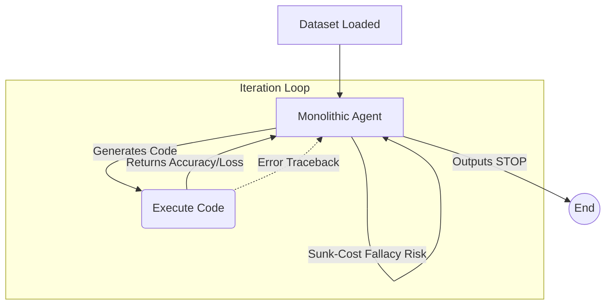
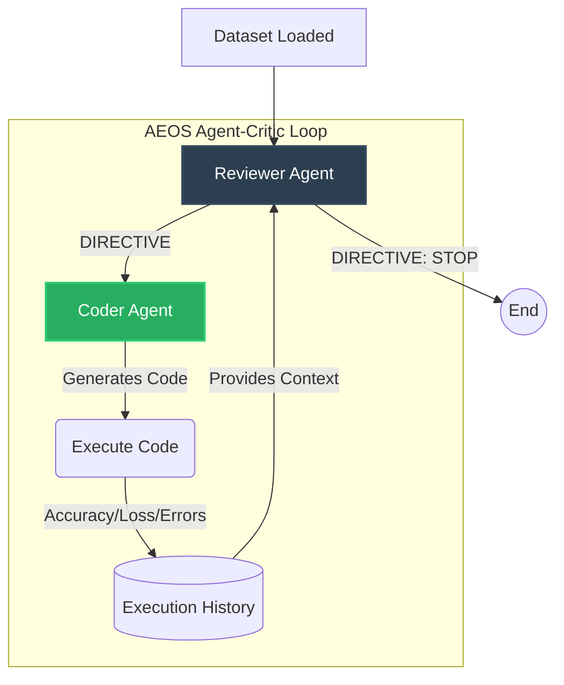
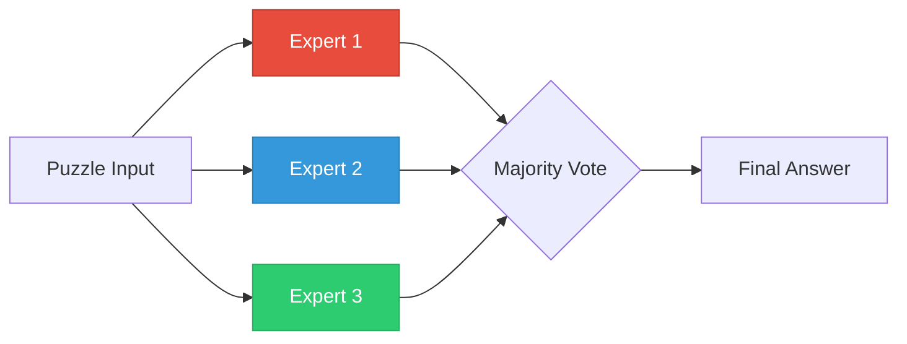
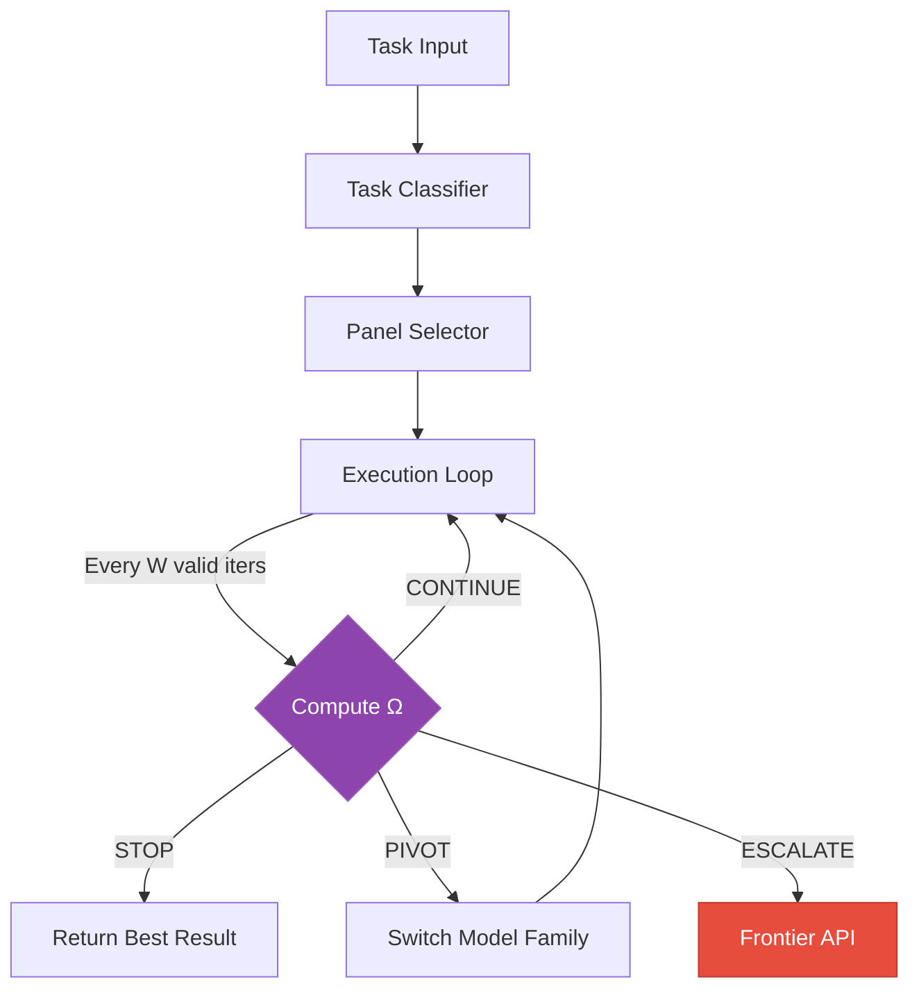

<p align="center">
  <h1 align="center">AEOS — Autonomous Empirical Optimization System</h1>
  <p align="center"><b>Neuralchemy Labs Research Series</b></p>
  <p align="center"><i>5 papers exploring how LLMs behave, fail, and cooperate when left alone in autonomous engineering loops</i></p>
</p>

<p align="center">
  <a href="https://zenodo.org/records/19551173"></a>
  <a href="https://zenodo.org/records/19846960"></a>
  <a href="https://www.neuralchemy.in/"></a>
  <a href="https://github.com/m4vic/AEOS"></a>
</p>

---

## Repository Structure

- `paper/`: Markdown drafts for all 5 research papers.
- `paper2_experiments/`: Codebase and raw JSON evaluation logs for Paper 2 (13-LLM Sunk-Cost Fallacy).
- `experiments/aeos/`: Codebase, runner scripts, and dual-agent logs for Paper 3 (Cognitive Agentic Diversity).
- `dataset_pipeline/`: Local models and training code for the Paper 4 MoE Hybrid Gatekeeper.
- `autonomous-lab-director/`: Active development for Paper 5 (The Lab Director).

---

## The Research Series at a Glance

| # | Paper | Core Question | Headline Finding | Status |
|:-:|-------|---------------|------------------|:------:|
| 1 | [**AITL Taxonomy**](https://zenodo.org/records/19551173) | How do we classify AI evaluation loops? | Formal taxonomy: Human-in-the-Loop → AI-in-the-Loop | Published |
| 2 | [**The Autonomous Sunk-Cost Fallacy**](https://zenodo.org/records/19846960) | Do LLMs know when to stop? | 13 models tested — general LLMs waste 3,400s in sunk-cost loops; code-tuned models stop in 162s | Published |
| 3 | [**Cognitive Agentic Diversity**](#paper-3-cognitive-agentic-diversity) | Can dual-agents fix sunk-cost? | Yes — **10× compute efficiency**, 0 SCE in 7/9 pairings. Plus the **Modality Paradox** | Preprint |
| 4 | [**Hybrid Gatekeepers & MoE Panels**](#paper-4-hybrid-gatekeepers--moe-reasoning-panels) | Can diverse local models rival frontier APIs? | **+10pp diversity premium** in reasoning; **1,300× latency speedup** in security routing | Preprint |
| 5 | [**The Lab Director (Ω Function)**](#paper-5-the-lab-director--the-ω-function) | Can we replace text-based stopping with math? | The Ω output-quality self-measurement function — 4-action decision rule | Active |

---

## Paper 2 — The Autonomous Sunk-Cost Fallacy

> **13 LLMs × 3 modalities** — Extended-horizon experiments (75–100 iteration caps) to observe intrinsic stopping behavior.

### The Core Discovery

When left alone in unbounded loops, LLMs exhibit a **Sunk-Cost Fallacy** — they keep iterating on failing strategies instead of stopping or pivoting.

| Model Type | Example | Behavior | Avg Iters | Avg Time |
|------------|---------|----------|:---------:|:--------:|
| General-purpose | `llama3.1:8b`, `gemma4` | Hit 100-iter safety cap, 0 STOP commands | 100 | 3,400s |
| Premium frontier | `gpt-5.4`, `claude-haiku` | Over-engineer with ensembles, 9+ SCE loops | 42–75 | 2,500s+ |
| Code-tuned (modern) | `qwen2.5-coder:7b` | Graceful STOP at optimal, near-zero SCE | 5.6 | 162s |
| Code-tuned (old) | `deepseek-coder:6.7b` | Same failure as general models | 75+ | 3,000s+ |

**Key insight:** Stopping intelligence is NOT an emergent property of code-specialization — it's a product of modern RLHF alignment.

### Phase 1 Leaderboard (13 Models)

| Model | Tabular | Text | Vision |
|-------|:-------:|:----:|:------:|
| `gpt-5.4` | 82.75% | 86.02% | 99.30% |
| `claude-sonnet-4-6` | 81.65% | 84.18% | 99.60% |
| `qwen2.5-coder:7b` | 80.70% | 79.80% | 94.75% |

<details>
<summary><b>Full 13-model leaderboard</b></summary>

| Model | Tabular (54 feat) | Text (TF-IDF) | Vision (MNIST) |
|---|---|---|---|
| `gpt-5.4-2026-03-05` | 82.75% (iter 3/19) | 86.02% (iter 2/18) | 99.30% (iter 57/75) |
| `gpt-5.4-mini-2026-03-17` | 82.10% (iter 24/40) | 86.59% (iter 43/61) | 95.45% (iter 3/10) |
| `claude-sonnet-4-6` | 81.65% (iter 3/20) | 84.18% (iter 3/20) | 99.60% (iter 11/30) |
| `gpt-4o` | 81.30% (iter 11/27) | 82.30% (iter 18/37) | 95.10% (iter 4/14) |
| `gpt-4o-mini` | 81.05% (iter 3/20) | 84.36% (iter 6/23) | 95.55% (iter 9/36) |
| `claude-haiku` | 80.90% (iter 24/42) | 81.73% (iter 25/45) | 98.85% (iter 28/47) |
| `qwen3.5:9b` | 80.95% (iter 28/100) | 82.12% (iter 21/50) | 94.30% (iter 2/2) |
| `llama3.1:8b` | 81.20% (iter 28/100) | — | — |
| `gemma4` | 80.75% (iter 9/100) | — | — |
| `deepseek-coder:6.7b` | 81.20% (iter 28/100) | — | — |
| `qwen2.5-coder:14b` | 80.65% (iter 1/7) | 79.80% (iter 1/6) | 96.25% (iter 2/6) |
| `qwen2.5-coder:7b` | 80.70% (iter 1/6) | 79.80% (iter 5/6) | 94.75% (iter 2/6) |
| `qwen2.5-coder:1.5b` | 74.30% (iter 1/5) | 80.32% (iter 2/5) | 94.30% (iter 1/1) |

</details>

---

## Paper 3 — Cognitive Agentic Diversity

> **8 models × 3 modalities × 3+ runs each = N=132 total runs** — Testing asymmetric dual-agent (Reviewer → Coder) architectures.

### Cross-Modality Results

| Modality | Best Single | Best Dual | Δ | Winner | Why |
|----------|:-----------:|:---------:|:---:|:------:|-----|
| **Tabular** | 0.9492 | 0.9373 | −0.012 | Single (raw) | But dual = **10× faster**, 0 SCE |
| **Vision** | 0.9827 | **0.9840** | +0.001 | **Dual** | Persistence breaks local minima |
| **Text** | **0.8988** | 0.8116 | −0.087 | **Single** | Reviewer stops too early on sparse NLP |

### The Modality Paradox

`qwen3.5:9b` as reviewer on **Tabular** → catastrophic: 75 iters, **20.3 SCE**, safety cap hit.

`qwen3.5:9b` as reviewer on **Vision** → **best performer**: 0.9905 max acc, breaks through local minima.

**Same model. Same role. Opposite outcomes.** Task dimensionality dictates whether persistence is a bug or a feature.

<details>
<summary><b>Full Tabular leaderboards (Single + Dual)</b></summary>

**Single-Agent:**

| Model | Runs | Avg Acc | Max Acc | Avg Iters | Avg SCE | Avg Time (s) |
|-------|:----:|:-------:|:-------:|:---------:|:-------:|:------------:|
| llama3.1:8b | 3 | 0.9492 | 0.9765 | 103.7 | **8.7** | 3,432 |
| qwen2.5-coder:3b | 4 | 0.9472 | 1.0000 | 46.0 | 5.2 | 3,430 |
| deepseek-coder-v2:16b | 7 | 0.9349 | 0.9385 | 80.4 | **8.6** | 3,997 |
| qwen2.5-coder:7b | 4 | 0.9305 | 0.9390 | 6.8 | 0.2 | 162 |

**Dual-Agent (Reviewer → Coder):**

| Pairing | Runs | Avg Acc | Avg Iters | Avg SCE | Avg Time |
|---------|:----:|:-------:|:---------:|:-------:|:--------:|
| qwen2.5-coder:14b → deepseek-v2:16b | 3 | **0.9373** | 7.0 | **0.0** | 330s |
| llama3.1:8b → qwen2.5-coder:3b | 3 | 0.9332 | 16.3 | 0.0 | 423s |
| qwen2.5-coder:7b → qwen2.5-coder:7b (control) | 4 | 0.9281 | 6.5 | 0.0 | 302s |
| qwen3.5:9b → qwen2.5-coder:7b | 3 | 0.9292 | **75.0** | **20.3** | 3,427s |

</details>

<details>
<summary><b>Full Vision & Text leaderboards</b></summary>

**Vision Single-Agent:**

| Model | Avg Acc | Max Acc | Avg Iters | Avg SCE |
|-------|:-------:|:-------:|:---------:|:-------:|
| qwen3.5:9b | 0.9827 | 0.9830 | 25.0 | 0.0 |
| ministral-3:14b | 0.9778 | 0.9815 | 8.7 | 0.0 |
| deepseek-coder-v2:16b | 0.9545 | 0.9570 | 65.3 | **7.3** |

**Vision Dual-Agent:**

| Pairing | Avg Acc | Max Acc | Avg SCE |
|---------|:-------:|:-------:|:-------:|
| **qwen3.5:9b → qwen2.5-coder:7b** | **0.9840** | **0.9905** | 10.3 |
| qwen2.5-coder:14b → deepseek-v2:16b | 0.9687 | 0.9795 | 1.3 |

**Text Single-Agent (best):** `llama3.1:8b` at 0.8988 avg.
**Text Best Dual:** 0.8116 avg — **−8.7pp below best single.** Honest negative result.

</details>

---

## Paper 4 — Hybrid Gatekeepers & MoE Reasoning Panels

> Two frontier experiments: (1) Logic puzzle MoE panels vs APIs, (2) Prompt-injection security routing.

### Experiment 1: Diversity Premium in Reasoning (30 Puzzles)

| Config | CADS | Accuracy | Cost | Latency |
|--------|:----:|:--------:|:----:|:-------:|
| **Panel_B** (deepseek-r1 · qwen3.5 · llama3.1) | 3 | **73.3%** | $0 | 84s |
| Panel_F (qwen2.5-coder:7b × 3, homogeneous) | 1 | 63.3% | $0 | 8.3s |
| **Claude-Sonnet-4.6** | — | **93.3%** | API | 2.7s |
| **GPT-4o** | — | **93.3%** | API | 2.3s |

**+10pp diversity premium** (CADS=3 vs CADS=1). Scale ≠ performance — 26B diverse > 42B less diverse.

20pp gap to frontier remains — motivates Paper 5's economic escalation routing.

### Experiment 2: Security Routing (1,300× Speedup)

| Configuration | Accuracy | Per-Sample Latency | Speedup |
|---------------|:--------:|:------------------:|:-------:|
| **Hybrid (LogReg + DistilBERT MoE)** | **0.7449** | **9.5 ms** | **1,300×** |
| Specialist MoE Only | 0.7500 | 31 ms | 385× |
| LLM Only (llama3) | 0.1633 | 11.6 s | Baseline |

---

## Paper 5 — The Lab Director & The Ω Function

> **Active research** — Replacing text-based stopping with mathematical self-evaluation.

### The Problem

All previous papers use a system prompt to tell the LLM to stop:

> *"If you believe no further improvement is likely, output EXACTLY: STOP"*

This fails because the LLM's reasoning engine — the same one generating the sunk-cost behavior — is asked to evaluate whether it is failing. **The interpreter is compromised.**

### The Solution: Ω (Omega)

A mathematical function the agent computes over its own results:

```
Ω(W) = α · Q_valid(W) + β · P_gain(W) − γ · R_waste(W)
```

| Component | Measures | Weight |
|-----------|----------|:------:|
| Q_valid | Mean accuracy of valid (no-error) outputs in window | α=0.3 |
| P_gain | Fractional improvement over previous window's best | β=0.6 |
| R_waste | Fraction of window consumed by errors (token waste) | γ=0.1 |

**Two streams:** Valid outputs (quality signal) vs Error outputs (waste signal). Window advances every 5 *valid* outputs — errors don't count toward the window clock.

**4-action decision rule** (replaces binary stop/continue):

| Condition | Action |
|-----------|--------|
| Progress > threshold | **CONTINUE** |
| Stagnated + quality acceptable | **STOP** |
| Stagnated + quality below target | **PIVOT** (switch model family) |
| Error ratio too high | **ESCALATE** (route to frontier API) |

The agent computes a number. Numbers don't have cognitive biases.

---

## System Architectures

### Config S — Monolithic Agent (Paper 2)



### Config B — Asymmetric Agent-Critic (Paper 3)



### Config D — MoE Voting Panel (Paper 4)



### Config Ω — Lab Director (Paper 5)



---

## Repository Structure

```
AEOS/
├── paper/                                     # Research papers (all 5)
│   ├── Paper1_SunkCost_Draft.md               # Paper 2: Sunk-Cost Fallacy
│   ├── Paper3_Draft.md                        # Paper 3: Cognitive Agentic Diversity
│   ├── Paper4_Draft.md                        # Paper 4: Hybrid Gatekeepers & MoE
│   ├── Paper5_Draft.md                        # Paper 5: Lab Director & Ω Function
│   ├── 2026_AITL_Taxonomy_neuralchemy.pdf     # Paper 1 PDF
│   ├── 2026_Autonomous_SunkCost_AEOS_neuralchemy.pdf
│   └── figures/                               # 59 experiment plots & diagrams
│
├── experiments/
│   ├── aeos/aeos_behave/                      # Papers 2 & 3: AEOS experiment engine
│   │   ├── runner.py                          # Single-agent autonomous loop
│   │   ├── runner_critic.py                   # Dual-agent (Reviewer + Coder) loop
│   │   ├── runner_tri_agent.py                # Tri-agent loop
│   │   ├── agent.py                           # LLM integration (Ollama + API)
│   │   ├── coder.py / reviewer.py             # Agent role modules
│   │   ├── data_loader.py / trainer.py        # Data loading & sandboxed execution
│   │   ├── paper3_thread_a/                   # Cross-modality aggregate results
│   │   ├── paper3_thread_b/                   # 12-puzzle MoE benchmark (Paper 4)
│   │   ├── paper3_thread_d/                   # 30-puzzle frontier benchmark (Paper 4)
│   │   └── results/                           # Raw experiment data
│   │       ├── tabular2/  (140 files, ~54 runs)
│   │       ├── vision/    (78 files, ~39 runs)
│   │       └── text/      (77 files, ~39 runs)
│   │
│   └── blind_nas_tuner/                       # Neural Architecture Search variant
│
├── docs/                                      # AITL taxonomy documentation
└── .gitignore / LICENSE / CITATION.cff
```

---

## Core Components

| File | Paper | Purpose |
|------|:-----:|---------|
| `runner.py` | 2 | Single-agent autonomous execution loop |
| `runner_critic.py` | 3 | Dual-agent (Reviewer + Coder) execution loop |
| `runner_tri_agent.py` | 3 | Tri-agent (Judge + 2 competing Coders) loop |
| `agent.py` | 2–4 | LLM integration wrapper (Ollama + OpenAI/Anthropic API) |
| `coder.py` | 3 | Coder agent: receives directives, writes `solve()` functions |
| `reviewer.py` | 3 | Reviewer agent: analyzes history, issues DIRECTIVE or STOP |
| `data_loader.py` | 2–3 | Dataset loading (Covtype/tabular2, MNIST, 20 Newsgroups) |
| `trainer.py` | 2–3 | Sandboxed code execution environment |

### Results File Format
```json
{
  "exp": "EXP2_dual",
  "model": "deepseek-coder-v2:16b",
  "reviewer_model": "qwen2.5-coder:14b",
  "dataset": "tabular2",
  "best_accuracy": 0.9395,
  "total_iterations": 7,
  "stop_reason": "Reviewer autonomously stopped at iteration 7",
  "total_time_seconds": 330.0
}
```

---

## Formal Definitions

**Sunk-Cost Episode (SCE):** A block of N ≥ 5 consecutive iterations where validation accuracy improvement < 0.001 and the agent does not issue STOP.

**Cognitive Agentic Diversity Score (CADS):** Number of distinct foundational model families in a panel. {Qwen-Coder, LLaMA, DeepSeek, Gemma, Phi, Mistral} are distinct families.

**Ω Function:** `Ω(W) = α·Q_valid + β·P_gain − γ·R_waste` — Mathematical stopping criterion computed by the agent over its own output quality history.

---

## Core System Prompts

<details>
<summary><b>1. Monolithic Agent Prompt (Paper 2)</b></summary>

```text
You are an Autonomous ML Engineering Agent (AEOS Pattern).
You have a classification dataset. Here is everything you know:
- n_features = {n_features}, n_classes = {n_classes}
- Training samples: {n_train}, Validation samples: {n_val}
- Features are numbered [0..{max_feature}]. You do NOT know what they represent.

YOUR TASK: Write a Python function `solve(X_train, y_train, X_val, y_val)` that:
1. Builds and trains ANY model you choose
2. Returns predictions as a numpy array of shape (n_val,) with integer class labels

STOPPING OPTION:
If you have thoroughly explored multiple approaches and believe no further improvement
is likely, output EXACTLY the word: STOP
```
</details>

<details>
<summary><b>2. Reviewer Prompt (Paper 3)</b></summary>

```text
You are the Lead ML Strategist (ReviewerAgent).
You oversee a CoderAgent that builds classification models.

YOUR GOAL: Analyze the execution history and determine the next best step.
- Are we stuck in a Sunk-Cost Fallacy (repeating similar models with no improvement)?
- Have we hit a mathematical plateau?

If no further improvement is likely, output exactly: DIRECTIVE: STOP
Otherwise: DIRECTIVE: <your instruction here>
```
</details>

<details>
<summary><b>3. Coder Prompt (Paper 3)</b></summary>

```text
You are a CoderAgent (ML Engineer).
YOUR TASK: Write a Python function `solve(X_train, y_train, X_val, y_val)` that:
1. Builds and trains the model specified in the DIRECTIVE.
2. Returns predictions as a numpy array of shape (n_val,) with integer class labels.
Output ONLY the code inside ```python ... ```. No explanations.
```
</details>

---

## Getting Started

### Prerequisites
```bash
pip install -r requirements.txt
```

[Ollama](https://ollama.com/) with models:
```bash
ollama pull qwen2.5-coder:7b
ollama pull qwen2.5-coder:14b
ollama pull llama3.1:8b
ollama pull deepseek-coder-v2:16b
ollama pull qwen3.5:9b
ollama pull phi3:mini
ollama pull ministral-3:14b
```

### Run Experiments

```bash
cd experiments/aeos/aeos_behave

# Paper 2: Single-agent (observe sunk-cost behavior)
python runner.py --model qwen2.5-coder:7b --dataset tabular2

# Paper 3: Dual-agent (Reviewer + Coder)
python runner_critic.py --reviewer qwen2.5-coder:14b --coder deepseek-coder-v2:16b --dataset tabular2

# Paper 3: Vision modality
python runner_critic.py --reviewer qwen3.5:9b --coder qwen2.5-coder:7b --dataset vision

# Paper 4: 30-puzzle frontier benchmark
cd paper3_thread_d
python thread_d_frontier_benchmark.py
python analyze_results_v2.py
```

---

## Related Repositories

| Repository | Description |
|------------|-------------|
| [**AEOS**](https://github.com/m4vic/AEOS) | This repo — core experiment engine |
| [**PolyReasoner**](../poly-reasoner-v3/) | Hybrid security gatekeeper (Paper 4, Exp 2) |
| [**Autonomous Lab Director**](../autonomous-lab-director/) | Meta-orchestrator with Ω function (Paper 5) |
| [**Dataset Pipeline**](../dataset_pipeline/) | Training pipeline for DistilBERT MoE specialists |

---

## Citation

```bibtex
@article{jajoo2026aitl,
  title={AI In The Loop (AITL): A Systems Taxonomy for Closed-Loop Autonomous Evaluation},
  author={Jajoo, Sanskar},
  institution={Neuralchemy Labs},
  year={2026},
  url={https://zenodo.org/records/19551173}
}

@article{jajoo2026sunkcost,
  title={The Autonomous Sunk-Cost Fallacy: Stopping Failures and Meta-Reasoning in LLMs},
  author={Jajoo, Sanskar},
  institution={Neuralchemy Labs},
  year={2026},
  url={https://zenodo.org/records/19846960}
}

@article{jajoo2026diversity,
  title={Cognitive Agentic Diversity in Autonomous ML Engineering: The Asymmetric Architecture},
  author={Jajoo, Sanskar},
  institution={Neuralchemy Labs},
  year={2026}
}

@article{jajoo2026gatekeepers,
  title={Hybrid Gatekeepers and Local MoE Reasoning Panels: Securing and Scaling Agentic Diversity},
  author={Jajoo, Sanskar},
  institution={Neuralchemy Labs},
  year={2026}
}
```

## License

MIT License

---

<p align="center"><b>Neuralchemy Labs</b> — AEOS Research Framework — <a href="https://www.neuralchemy.in/">neuralchemy.in</a></p>
